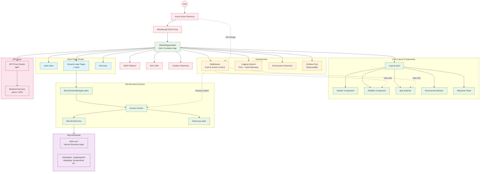

# Utbetalingsportalen System Diagram

```mermaid
graph TB
    %% External Services
    User((User))
    AAD[Azure Active Directory]
    NAIS[NAIS Platform]
    CDN[NAV CDN]
    Telemetry[Grafana Telemetry]
    Wonderwall[Wonderwall SSO Proxy]
    
    %% Main Application Container
    UP[Utbetalingsportalen<br/>Astro Container App]
    
    %% Core Layout Components
    subgraph CoreComponents["Core Layout Components"]
        Layout[Layout.astro]
        Header[Header Component]
        SideBar[SideBar Component]
        AppSwitcher[App Switcher]
        EnvBanner[Environment Banner]
        WelcomePanel[Welcome Panel]
    end
    
    %% Microfrontend System
    subgraph MFSystem["Microfrontend System"]
        MFWrapper[MicrofrontendWrapper.astro]
        MFComponent[Microfrontend.tsx]
        AccessControl[Access Control]
        NoAccess[NoAccess.astro]
    end
    
    %% Microfrontends
    subgraph Microfrontends["Microfrontends"]
        MF1[sokos-up-*<br/>Various Business Apps]
        MF2[Attestasjon, Oppdragsinfo,<br/>Utbetaling, Buntkontroll, etc.]
    end
    
    %% Pages
    subgraph Pages["Astro Page Routes"]
        IndexPage[index.astro]
        AppPages[Dynamic App Pages<br/>/*.astro]
        Page404[404.astro]
    end
    
    %% APIs
    subgraph APILayer["API Layer"]
        APIProxies[API Proxy Routes<br/>/api/*]
        BackendServices[Backend Services<br/>sokos-* APIs]
    end
    
    %% Infrastructure
    subgraph Infrastructure["Infrastructure"]
        Middleware[Middleware<br/>Auth & Access Control]
        Logger[Logging System<br/>Pino + OpenTelemetry]
        Environment[Environment Detection]
        Observability[Grafana Faro<br/>Observability]
    end
    
    %% User Flow
    User --> AAD
    AAD --> Wonderwall
    Wonderwall --> UP
    
    %% Main App Structure
    UP --> Layout
    Layout --> Header
    Layout --> SideBar
    Layout --> EnvBanner
    Layout --> AppSwitcher
    Layout --> WelcomePanel
    
    %% Page Routing
    UP --> IndexPage
    UP --> AppPages
    UP --> Page404
    
    %% Microfrontend Loading
    AppPages --> MFWrapper
    MFWrapper --> AccessControl
    AccessControl --> MFComponent
    AccessControl --> NoAccess
    MFComponent --> Microfrontends
    
    %% API Routing
    UP --> APIProxies
    APIProxies --> BackendServices
    
    %% External Dependencies
    UP --> CDN
    UP --> Telemetry
    UP --> NAIS
    
    %% Infrastructure Integration
    UP --> Middleware
    UP --> Logger
    UP --> Environment
    UP --> Observability
    
    %% Authorization Flow
    AAD -.->|AD Groups| Middleware
    Middleware -.->|User Info| SideBar
    Middleware -.->|User Info| AppSwitcher
    Middleware -.->|Access Control| AccessControl
    
    %% Styling
    classDef external fill:#ffebee,stroke:#d32f2f
    classDef infrastructure fill:#fff3e0,stroke:#f57c00
    classDef core fill:#e8f5e8,stroke:#388e3c
    classDef microfrontend fill:#f3e5f5,stroke:#7b1fa2
    classDef pages fill:#e1f5fe,stroke:#1976d2
    classDef apis fill:#fce4ec,stroke:#c2185b
    
    class User,AAD,NAIS,CDN,Telemetry,Wonderwall external
    class Middleware,Logger,Environment,Observability infrastructure
    class UP,Layout,Header,SideBar,AppSwitcher,EnvBanner,WelcomePanel,MFWrapper,MFComponent,AccessControl,NoAccess core
    class MF1,MF2,Microfrontends microfrontend
    class IndexPage,AppPages,Page404 pages
    class APIProxies,BackendServices,APILayer apis
```
