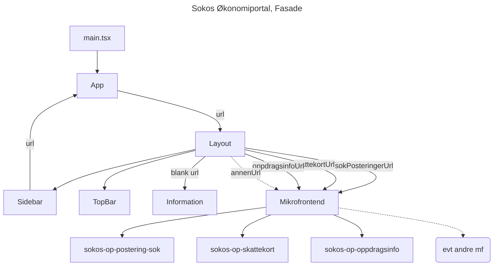

# Ny økonomiportal

# Autentisering

For å vise Layouten med SideBar, Topbar og vinduet for informasjon eller hvert Skjermbilde, må man ha
tilgang til en eller flere Skjermbilder.
Vi bruker [nais](https://doc.nais.io/nais-application/application/#azureapplicationclaimsgroups)
og AD-grupper for å håndtere tilganger.
Hvis man ikke har noen slike tilganger vil Nais-[Sidecar](https://doc.nais.io/security/auth/azure-ad/sidecar/index.html)
hindre videre visning av Fasaden.

Lenkene til Skjermbildene ligger i Sidebar, og vi viser bare de lenkene som bruker har tilgang til.

Det er i App.tsx at selve autoriseringssjekken utføres, så uavhengig av om URLen kommer fra nettleser eller
en av lenkene i SideBar, så gjøres det en sjekk på om brukeren er medlem i AD-gruppen for det spesifikke
Skjermbildet før man tillates å følge lenken og vise innholdet.

For å legge til et ekstra Skjermbilde kan man følge [denne oppskriften](mikrofrontend.md)!
